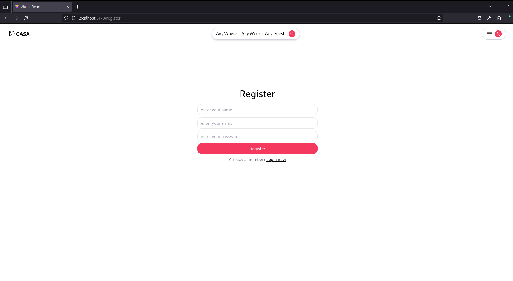

# Place Booking App

This project is a Holiday Room Booking App built using React, Express, and MongoDB. It allows users to book rooms for their holidays. The application comes with features like authentication, image uploading, and house details editing.

# IMAGE:

# Features

User Authentication: Users can sign up and log in securely to the application.
Room Booking: Users can browse available rooms and book them for their holidays.
Image Upload: Users can upload images from their local storage or using a link when listing their own house for rent.
House Listing: Users can list their own houses for rent, including details like title and images.
House Details Editing: Users can edit the details of the houses they have listed.
No Payment Method: The application does not handle payment methods. It focuses on the booking and listing aspects only.
Technologies Used
React: Used for building the frontend user interface.
Express: Used to create the backend server and API endpoints.
MongoDB: Used as the database to store user data, room bookings, and house details.
Authentication: Implemented user authentication using JWT (JSON Web Tokens) for secure access to the application.
Image Upload: Integrated image uploading functionality, allowing users to upload images for their house listings using image-downloader library.
RESTful API: Developed RESTful API endpoints to handle user authentication, booking, places listing, and editing.
Setup Instructions
To run the project locally, follow these steps:

Clone the repository to your local machine
Navigate to the project directory:
cd Place-booking-app
Install dependencies for both the client and api:

# Install client dependencies
cd client
npm install
npm run dev

# Install api dependencies
cd ../api
nodemon index
Set up the MongoDB database:

Install MongoDB on your system if you haven't already.
Create a new MongoDB database for the application.
Configure environment variables:

Create a .env file in the api directory.
Define environment variables such as MONGODB_URL=mongodb://localhost:27017.
Run the application:

Start the api server:
nodemon index

Open your web browser and visit http://localhost:5173 to access the Holiday Room Booking App.

